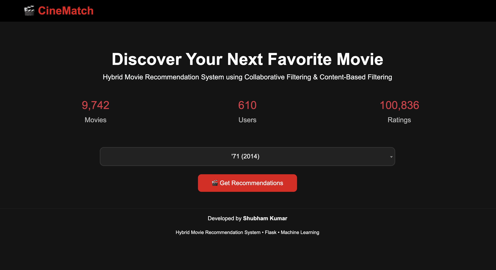
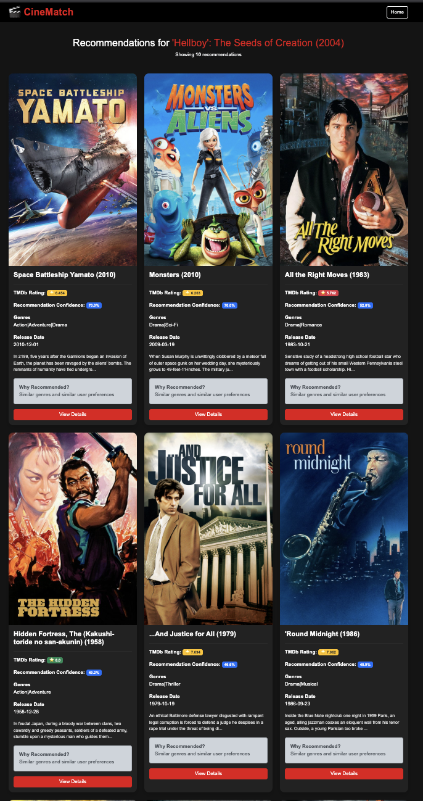
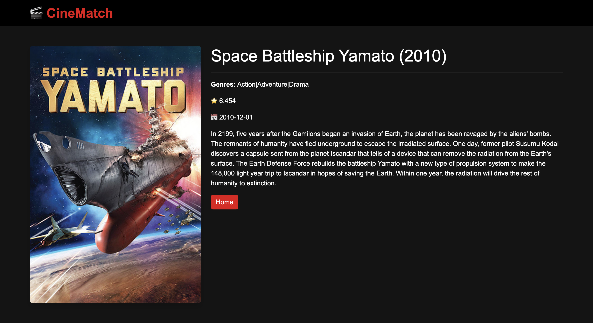

# 🎬 CineMatch – Hybrid Movie Recommendation System

<p align="center">

A Hybrid Movie Recommendation System built using <strong>Flask</strong>, <strong>Collaborative Filtering</strong>, <strong>Content-Based Filtering</strong>, and the <strong>TMDb API</strong>.

</p>

<p align="center">


</p>

---

# 🌐 Live Demo

🚀 **Live Application**

https://cinematch-ai-6bzt.onrender.com

---

# 📌 Project Overview

CineMatch is a **Hybrid Movie Recommendation System** that combines the strengths of:

- 🎯 Collaborative Filtering
- 🎭 Content-Based Filtering

to provide highly relevant movie recommendations.

The application integrates with **The Movie Database (TMDb)** API to enrich recommendations with:

- Movie Posters
- Ratings
- Release Dates
- Overviews

The recommendation engine is evaluated using **Precision@K**, making it both practical and academically sound.

---

# ✨ Features

✅ Hybrid Recommendation Engine

✅ Collaborative Filtering (Cosine Similarity)

✅ Content-Based Filtering (TF-IDF)

✅ Weighted Hybrid Scoring

✅ Searchable Movie Selection

✅ TMDb Poster Integration

✅ TMDb Ratings

✅ Movie Overviews

✅ Release Dates

✅ Movie Details Page

✅ Responsive Bootstrap UI

✅ Precision@5 Evaluation

✅ Precision@10 Evaluation

---

# 🛠 Tech Stack

## Backend

- Python
- Flask

## Machine Learning

- Pandas
- NumPy
- Scikit-learn
- TF-IDF Vectorizer
- Cosine Similarity

## Frontend

- HTML5
- CSS3
- Bootstrap 5
- JavaScript
- jQuery
- Select2

## External API

- TMDb API

---

# 🧠 Recommendation Approach

## 1️⃣ Collaborative Filtering

- Builds a User–Movie Rating Matrix
- Uses Cosine Similarity
- Finds movies liked by users with similar preferences

---

## 2️⃣ Content-Based Filtering

- Uses Movie Genres
- TF-IDF Vectorization
- Computes Genre Similarity

---

## 3️⃣ Hybrid Recommendation

The final recommendation score is computed as:

```
Final Score = α × Collaborative Score + (1 − α) × Content Score
```

Where:

- α = Hybrid Weight
- Collaborative Score = User Preference Similarity
- Content Score = Genre Similarity

---

# 📊 Evaluation

The recommendation system was evaluated using Precision@K.

| Metric | Score |
|---------|------:|
| Precision@5 | **0.0471** |
| Precision@10 | **0.0381** |

---

# 📂 Dataset

**MovieLens 100K**

Dataset Statistics

- 🎬 Movies: **1,682**
- 👤 Users: **943**
- ⭐ Ratings: **100,000**

Dataset Source:

https://grouplens.org/datasets/movielens/100k/

---

# 📁 Project Structure

```text
movie-recommender/
│
├── app.py
├── README.md
├── requirements.txt
├── Procfile
├── .env.example
├── .gitignore
│
├── data/
│   ├── movies.csv
│   └── ratings.csv
│
├── models/
│   ├── collaborative.py
│   ├── content_based.py
│   ├── hybrid.py
│   └── evaluate.py
│
├── utils/
│   ├── data_loader.py
│   └── tmdb.py
│
├── templates/
│   ├── index.html
│   ├── recommend.html
│   └── movie.html
│
├── static/
│   └── css/
│       └── style.css
│
└── screenshots/
    ├── home.png
    ├── recommendations.png
    └── movie-details.png
```

---

# 🚀 Installation

## Clone Repository

```bash
git clone https://github.com/shubhamgcet23-hue/cinematch-hybrid-movie-recommender.git

cd cinematch-hybrid-movie-recommender
```

---

## Create Virtual Environment

### macOS/Linux

```bash
python3 -m venv venv

source venv/bin/activate
```

### Windows

```bash
python -m venv venv

venv\Scripts\activate
```

---

## Install Dependencies

```bash
pip install -r requirements.txt
```

---

## Configure Environment Variables

Create a `.env` file.

```text
TMDB_API_KEY=YOUR_TMDB_API_KEY
```

---

## Run the Application

```bash
python app.py
```

Visit

```
http://127.0.0.1:5001
```

---

# 📸 Screenshots

## 🏠 Home Page



---

## 🎬 Recommendation Page



---

## 🎥 Movie Details Page



---

# 🎯 Future Improvements

- User Authentication
- Personalized User Recommendations
- Trending Movies Section
- Watchlist Feature
- Movie Reviews
- Docker Deployment
- Recommendation Explanations using AI

---

# 👨‍💻 Author

**Shubham Kumar**

B.Tech – Computer Science engineering (specialization in Design)

Aspiring Software Engineer

GitHub

https://github.com/shubhamgcet23-hue

LinkedIn

www.linkedin.com/in/shubham-kumar2027

---

# ⭐ Support

If you found this project useful,

⭐ **Star this repository** on GitHub!

---

<p align="center">

Made with ❤️ using Flask, Machine Learning and Python.

</p>
